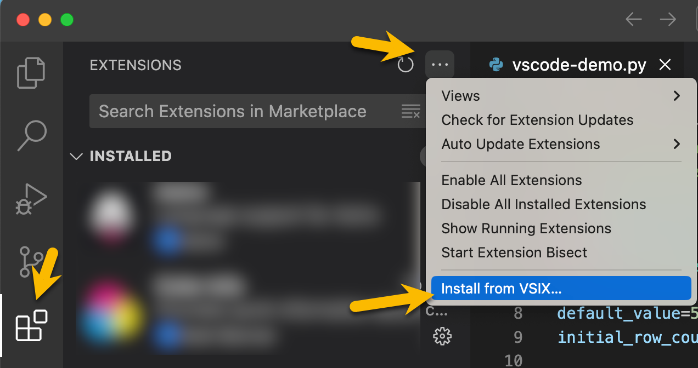

# Contributing to Deephaven in VS Code

## Development

### Unit Testing

Unit tests are configured to run via `vitest`. To run them:

```sh
npm run test
```

### End-to-end Testing

End-to-end tests are configured to run via `wdio-vscode-service`. This allows
testing workflows and has better abstractions for ui testing than `@vscode/test-electron`.

See [wdio-vscode-service](https://www.npmjs.com/package/wdio-vscode-service) for more details.

To run end-to-end tests:

```sh
npm run test:e2e
```

To run using `vscode` debugger:

1. Set a breakpoint in a test
2. Either

   Enable auto attach with flag (`Command palette -> Debug: Toggle Auto Attach -> Only With Flag`).

   > Note you may need to open a new terminal for this to take effect.

   or

   Open `Javascript Debug Terminal` (Click the dropdown arrow beside the + button for adding a new terminal)

3. Run the script:

   ```sh
   npm run test:e2e
   ```

4. You should see the tests start and `vscode` stop at the breakpoint.

## Installation from .VSIX

This extension can also be installed directly from a `.vsix`. To get a `.vsix`, you can either:

Download one from the [releases/](releases/) folder.

or

Build a .vsix locally via `npm run package`

Then install in vscode:


## Publishing

### Configuration

Publishing a vscode extension requires:

- Azure AD organization - https://dev.azure.com/deephaven-oss/
- Marketplace publisher - https://marketplace.visualstudio.com/publishers/deephaven
- Personal access token - associated with a user in the Azure AD organization
  > NOTE: This can be set in `VSCE_PAT` env variable

### Versioning Strategy

We are following the official `vscode` extension publishing guidance.

- Pre-release versions use `major.ODD_NUMBER.patch` version scheme (e.g. `1.1.3`)
- Release versions use `major.EVEN_NUMBER.patch` versions scheme (e.g. `1.2.3`)

> Note that `vscode` will always install a later release version instead of pre-release, so it's important to always have a pre-release version that is later than the release version if we want to allow pre-release users to stay on the latest pre-release.

You can find additional details here:
https://code.visualstudio.com/api/working-with-extensions/publishing-extension#prerelease-extensions

### Publish a new Version

1. Set `VSCE_PAT` env variable to personal access token for a user in the https://dev.azure.com/deephaven-oss/ org.
1. Increment the version number in `package.json`
   > See [versioning strategy](#versioning-strategy) for details on our version number scheme.
1. Package latest `npm run package:latest` (inspect output for any unexpected files included)
1. Use `vsce` cli to publish to Visual Studio Marketplace

   ```sh
   # Pre-release
   npm run publish:pre
   ```
1. Create a version tag with `-pre` suffix. e.g. `git tag v0.1.10-pre` 

## PNG Generation

Logo .pngs were generated from .svgs using `rsvg-convert`

```
rsvg-convert -w 128 -h 128 images/dh-community-on-dark-128.svg -o images/dh-community-on-dark-128.png
rsvg-convert -w 128 -h 128 images/dh-community-on-light-128.svg -o images/dh-community-on-light-128.png
```

## Icon Font Generation
The extension uses an icon font generated from SVGs in `@deephaven/icons`. Running the generator requires a local checkout of web-client-ui.

The generator can be run via the following script, where `<path-to-dh-icons-directory>` is the location of `packages/icons/src/icons` in `web-client-ui`.
```sh
npm run icon:gen -- <path-to-dh-icons-directory>
```

The script will automatically copy `icons/dist/dh-icons.woff2` file to the `/assets` folder of the extension, but the contents of `icons/dist/dh-contributes-icons.json` has to be manually copied to the `package.json` `contributes/icons` section.
> Note: All of the icons should be consumed via the `dh-xxx` icon ids, so no code changes should be necessary unless icons have been renamed or removed.

## Implementation Notes

### Server Connection

### DHC

The first time a connection is made to a `DHC` server, the extension will:

1. Download the JS API from the server
2. Check server auth config. If anonymous, connect anonymously. If `PSK` prompt for `PSK`.

If auth succeeds and connection was initiated by running a script:

1. Run the script against the server
2. Update panels in vscode and deephaven.

On subsequent script runs, the session will be re-used and only steps 4 and 5 will run

### Downloading JS API

The extension dynamically downloads and loads the DH JS API from a running DH Core server. At runtime, `dh-internal.js` and `dh-core.js` are downloaded from the running DH server (default http://localhost:10000). The files are saved to `out/util/tmp` as `.cjs` modules, and import / export are converted to cjs compatible ones. For implementation details, see [src/dh/dhc.ts#getDhc](https://github.com/deephaven/vscode-deephaven/blob/main/src/dh/dhc.ts#L62).
