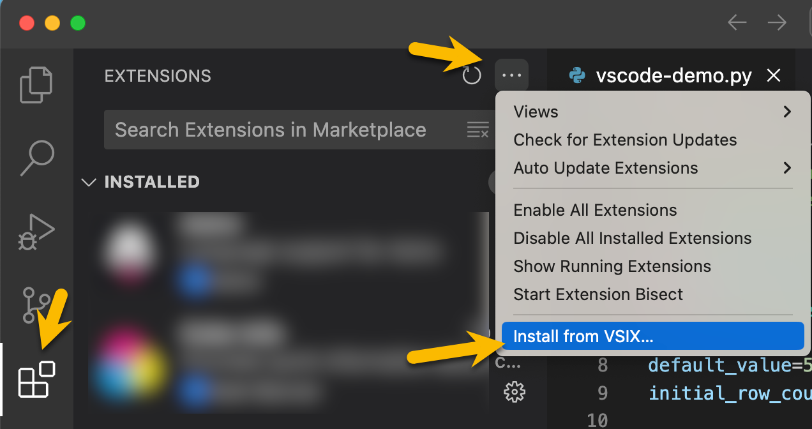

# Contributing to Deephaven VS Code Extension

## Development

### Deephaven Packages
The extension depends on some Deephaven web-client-ui npm packages (`@deephaven/*`). In cases where the dependencies need to be developed as part of extension development, the dependencies can be aliased locally to the location of the web-client-ui packages source code.

1. Create a `.env.local` file in the root of this project 
1. Set the `DHC_PACKAGES_PATH` env variable to the path of the web-client-ui/packages directory

e.g.
```ini
DHC_PACKAGES_PATH=/path/to/web-client-ui/packages/
```

Note that if you have already started the debugger, you will need to kill all of the prelaunch tasks and restart the debugger in order for config changes to take effect.

### Unit Testing

Unit tests are configured to run via `vitest`. To run them:

```sh
npm run test
```

### End-to-end Testing

End-to-end tests are configured to run via `vscode-extension-tester. This allows
testing workflows and has better abstractions for ui testing than `@vscode/test-electron`.

See [vscode-extension-tester](https://github.com/redhat-developer/vscode-extension-tester) for more details.

To run end-to-end tests:

```sh
npm run test:e2e
```

To run using `VS Code` debugger:

1. Set a breakpoint in a test
2. Run the `e2e Tests` launch config in VS Code
3. You should see the tests start and `VS Code` stop at the breakpoint

The `vscode-extension-tester` library uses `Mocha` to run tests. If you need to tweak debugging settings such as test timeout, you can do so in [`e2e-testing/src/mocharcDebug.ts`](./e2e-testing/src/mocharcDebug.ts).

### Documentation

The `/docs` directory contains the documentation for Deephaven VS Code Extension.

If any changes were made to docs, you **must** format them before committing changes.

```sh
npm run docs:start # Start docs server on port 3001. -p <port> to run on a different port.
npm run docs:format # Format all docs using dprint.
npm run docs:validate # Validates the docs build and links are valid.
``` 

## VSCE
[vsce](https://github.com/microsoft/vscode-vsce), short for "Visual Studio Code Extensions", is a command-line tool for packaging, publishing and managing `VS Code` extensions. The Deephaven extension calls `vsce` via npm scripts. Note that `vsce package` and `vsce publish` both call the `vscode:prepublish` script.

## Installation from .VSIX

This extension can also be installed directly from a `.vsix`. To get a `.vsix`, you can either:

Download one from the [releases/](releases/) folder.

Alternatively, you can build a `.vsix` locally by running `npm run package:dev`. This will create a version with a `-dev` prerelease identifier and incremental build number (e.g., `1.0.10-dev.0`). Each subsequent run increments the build number.

You can optionally specify a custom prerelease identifier:

```sh
npm run package:dev        # Creates 1.0.10-dev.0
npm run package:dev alpha  # Creates 1.0.10-alpha.0
npm run package:dev beta   # Creates 1.0.10-beta.0
```

The packaged extension will be saved as `releases/vscode-deephaven-$PACKAGE_VERSION.vsix`.

(see [VSCE](#vsce) section)

Then install in `VS Code`:


## Publishing

### Configuration

Publishing a `VS Code` extension requires:

- Azure AD organization - https://dev.azure.com/deephaven-oss/
- Marketplace publisher - https://marketplace.visualstudio.com/publishers/deephaven
- Personal access token - associated with a user in the Azure AD organization. Will need to have Marketplace publishing permissions.
  > NOTE: This can be set in `VSCE_PAT` env variable

### Versioning Strategy

We are following the official `VS Code` extension publishing guidance.

- Pre-release versions use `major.ODD_NUMBER.patch` version scheme (e.g. `1.1.3`)
- Release versions use `major.EVEN_NUMBER.patch` versions scheme (e.g. `1.2.3`)

> Note that `VS Code` will always install a later release version instead of pre-release, so it's important to always have a pre-release version that is later than the release version if we want to allow pre-release users to stay on the latest pre-release.

You can find additional details here:
https://code.visualstudio.com/api/working-with-extensions/publishing-extension#prerelease-extensions

We create tags for released commits as well as named branches (`vX.X.X-pre` and `vX.X.X-release`). These branches do not get merged or deleted but serve to keep a record of the actual commit that was published + the corresponding package.json version bump.

### Publish a new Version

See [versioning strategy](#versioning-strategy) for details on our version number scheme.

#### Choosing a Commit
Before publishing, you will need to checkout the commit to be published.

##### Pre-release
This will typically be latest `main` 

##### Release
Releases should be published from a tagged commit for an existing `pre-release`. e.g. To deploy `v1.0.7-release`, we deploy from the `v1.1.7-pre` tag. Since the `publish.sh` script increments based on the previous release tag, it's important to do a release corresponding to every pre-release to keep things in sequence.

1. Determine what the next release tag will be:

   ```sh
   ./scripts/nextreleasetag.sh
   ```
 
1. Checkout the corresponding pre-release tag (the minor version should be odd) 

   e.g. If the script yields `1.0.7-release`, run
   ```sh
   git checkout v1.1.7-pre
   ```

#### Verify Package Contents
To verify the package will include what you expect, run:
```sh
npx vsce ls
```
1. If expected content is missing or unexpected content is included, the `.vscodeignore` file will likely need to be updated in a separate PR before doing the release (this should not be common).
1. Optionally run `npm run package:dev` if you want to locally install a `.vsix` for testing before publishing.

#### Publish a New Version
1. Make sure you are in a clean branch whose HEAD points to the commit to publish (see [Choosing a Commit](#choosing-a-commit)).
1. `npm install` to ensure npm packages up to date
1. Make sure you are logged in with `vsce` using a personal access token for a user in the https://dev.azure.com/deephaven-oss/ org. `npx vsce login deephaven`.

To run a `pre-release` run:

```sh
npm run publish:prerelease
```

To run a `release` run:

```sh
npm run publish
```

> Note that new features should typically go through a `pre-release` before a release. Otherwise, early adopters won't get released features.

> Note if the publish fails due to an expired token, you can just re-run the appropriate `npx vsce publish` cmd found at the end of the `scripts/publish.sh` file.

#### Release Notes
After a successful pre-release / release, release notes can be created here: https://github.com/deephaven/vscode-deephaven/releases. A branch will have been created for the release. Just leave this as-is. No need to merge or delete.

## PNG Generation

Logo .pngs were generated from .svgs using `rsvg-convert`

```
rsvg-convert -w 128 -h 128 images/dh-logo-128.svg -o images/dh-logo-128.png
```

## Icon Font Generation
The extension uses an icon font generated from SVGs in `@deephaven/icons`. Running the generator requires a local checkout of web-client-ui.

The generator can be run via the following script, where `<path-to-dh-icons-directory>` is the location of `packages/icons/src/icons` in `web-client-ui`.
```sh
npm run icon:gen -- <path-to-dh-icons-directory>
```

The script will automatically copy `icons/dist/dh-icons.woff2` file to the `/assets` folder of the extension, but the contents of `icons/dist/dh/dh-contributes-icons.json` has to be manually copied to the `package.json` `contributes/icons` section.
> Note: All of the icons should be consumed via the `dh-xxx` icon ids, so no code changes should be necessary unless icons have been renamed or removed.

## Implementation Notes

### Server Connection

### DHC

The first time a connection is made to a `DHC` server, the extension will:

1. Download the JS API from the server
2. Check server auth config. If anonymous, connect anonymously. If `PSK` prompt for `PSK`.

If auth succeeds and connection was initiated by running a script:

1. Run the script against the server
2. Update panels in `VS Code` and deephaven.

On subsequent script runs, the session will be re-used and only steps 4 and 5 will run

### Downloading JS API

The extension dynamically downloads and loads the DH JS API from a running DH Core server. At runtime, `dh-internal.js` and `dh-core.js` are downloaded from the running DH server (default http://localhost:10000). The files are saved to `out/util/tmp` as `.cjs` modules, and import / export are converted to cjs compatible ones. For implementation details, see [src/dh/dhc.ts#getDhc](https://github.com/deephaven/vscode-deephaven/blob/main/src/dh/dhc.ts#L62).
