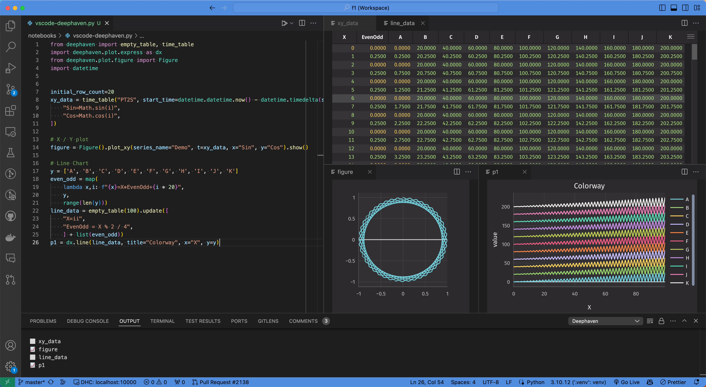
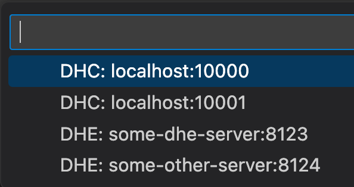
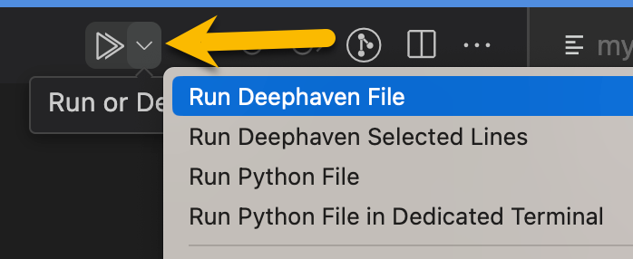
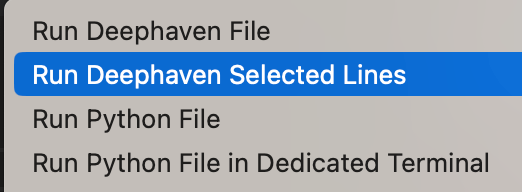
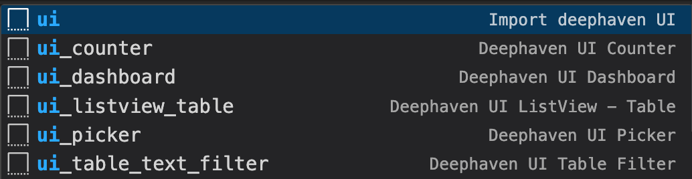

# vscode-deephaven

Deephaven in VS Code

- Run Python dh scripts from vscode against a running DH core server
  - Run all
  - Run selected code
- View output in vscode panels



## Installation

> Note: There are some `vscode` bugs that cause some flakiness with the `run` button. vscode `v90` introduced an optional `workbench.editor.alwaysShowEditorActions` setting. Setting this to `true` improves the experience here. Namely the run button will not disappear when running commands or selecting its dropdown. See https://github.com/deephaven/vscode-deephaven/issues/1 for more details.

## Connecting to a Server

Core server `http://localhost:10000/` is configured by default and doesn't require any additional config. Additional connections can be configured in `vscode` settings.

e.g. `.vscode/settings.json`

```json
{
  // Core servers
  "deephaven.coreServers": [
    "http://localhost:10000/",
    "http://localhost:10001"
  ]
}
```

To select the active connection that scripts will be run against, click the connection picker in the bottom status bar of vscode.

> Note: If you don't select a connection, the first one will be automatically used the first time a script is run.


Then select one of the servers:



## Running Scripts

Scripts will be run against the active connection or default to the first connection if none is selected.

1. Start a DH core server at http://localhost:1000
2. Open a DH Python script in vscode
3. Click the caret on the `Run` button in the top right of the editor and select `Run Deephaven File`

   

> Note that `vscode` should remember your selection so you can just click the `run` button (play icon) the next time; however, we have observed cases where this does not always work.

### Run a selection

1. Select text to run
2. Click the caret on the `Run` button in the top right of the editor and select `Run Deephaven Selected Lines`

   

> Note that `vscode` should remember your selection so you can just click the `run` button (play icon) the next time; however, we have observed cases where this does not always work.

## Code Snippets

The `vscode-deephaven` extension comes with some predefined `python` snippets. These insert pre-defined code snippets into an editor. To use, simply type `ui` in an opened `python` file to see available snippets.


