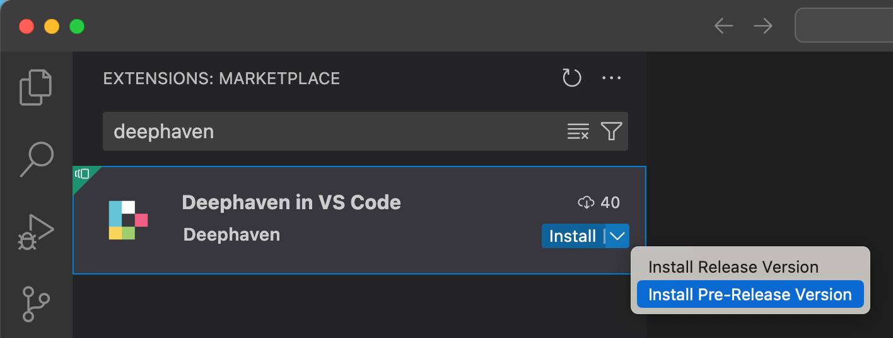
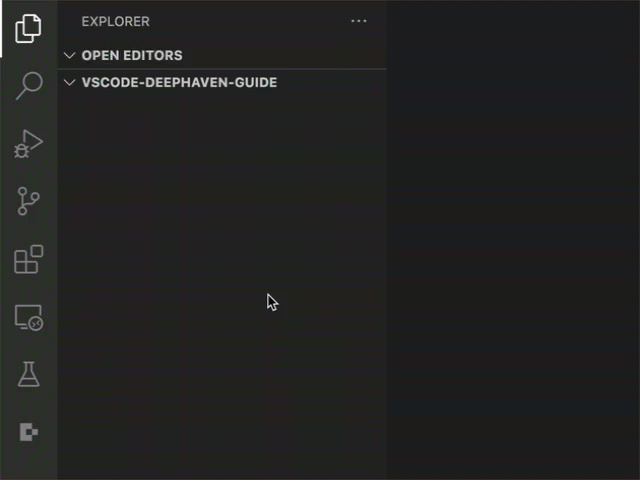
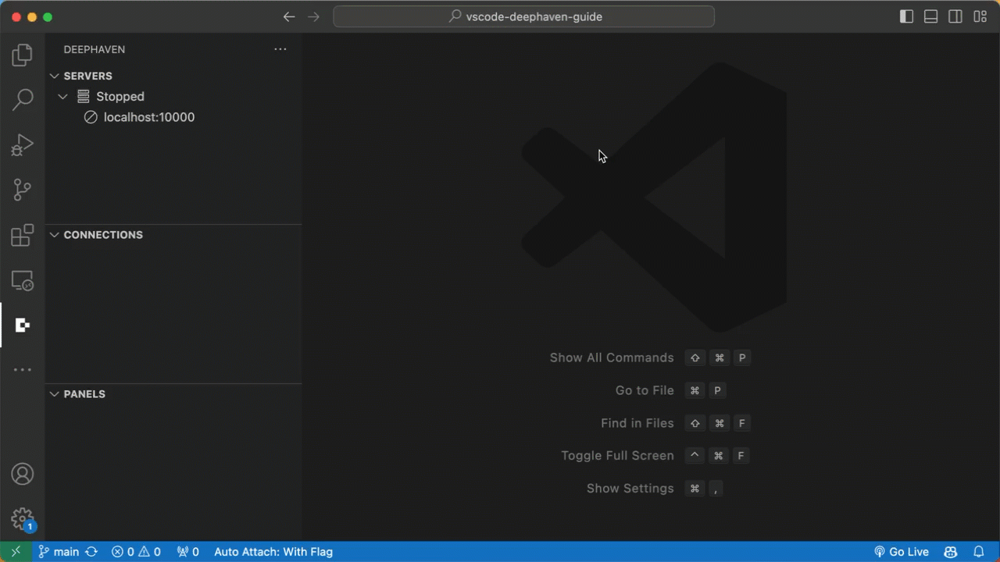
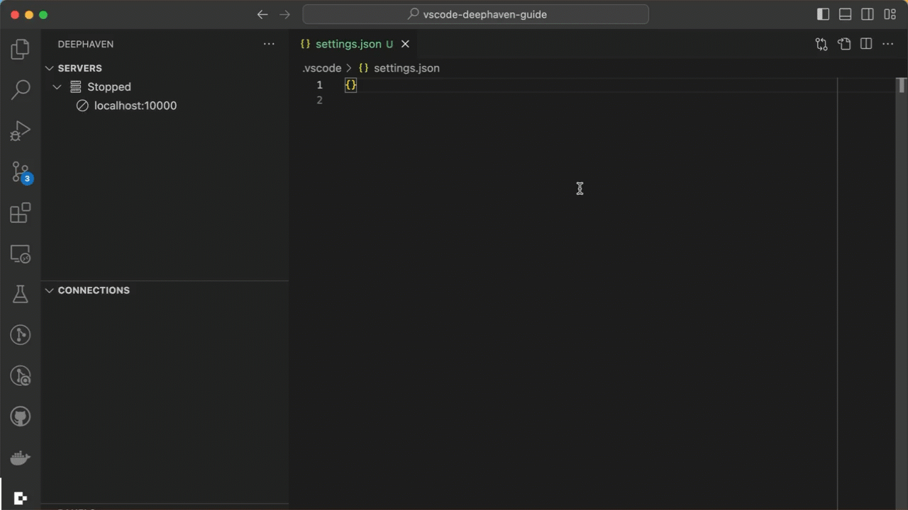
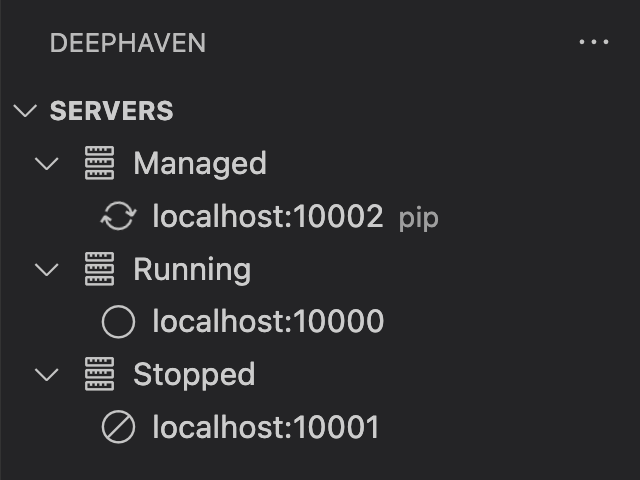
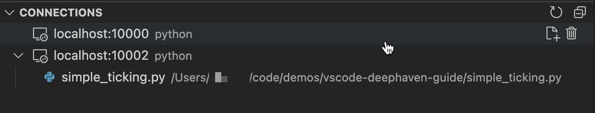
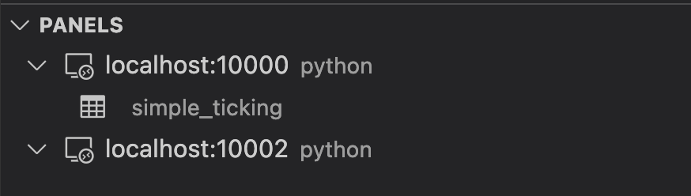

# Deephaven VS Code Extension

## Installation

The Deephaven VS Code extension can be installed from the [VS Code Marketplace](https://marketplace.visualstudio.com/items?itemName=deephaven.vscode-deephaven) or from the extension browser inside of `VS Code`. The extension is currently `pre-release`, so you'll need to install it as such.



Once installed, there will be a new icon in the `activity bar` (the sidebar containing navigation icons). Clicking the Deephaven icon will show a new panel containing details of configured Deephaven servers. By default, the extension is configured to connect to a single Community server hosted at `http:localhost:10000`.



The "SERVERS" tree will show the status of any configured servers. 


## Running Code
To run a script against a running server, simply click the `Run Deephaven File` action at the top of a file supported by the server (`python` or `groovy`).


A new connection will show up in the "CONNECTIONS" tree, and the "PANELS" should show any variables exposed on the connection. To disconnect, hover over the connection item and click the trash icon.

### Markdown Code Blocks
Python and Groovy codeblocks in Markdown files can be run by clicking the "Run Deephaven Block" action directly above the codeblock.


## Configuration

A single Community server `http://localhost:10000/` is configured by default and doesn't require any additional config. Additional connections can be configured in `VS Code` settings.

> Note: There are some `VS Code` bugs that cause some flakiness with the `run` button. `VS Code` `v90` introduced an optional `workbench.editor.alwaysShowEditorActions` setting. Setting this to `true` improves the experience here. Namely the run button will not disappear when running commands or selecting its dropdown. See https://github.com/deephaven/vscode-deephaven/issues/1 for more details.

### Community Servers

Community servers can be configured via the `"deephaven.coreServers"` setting in `VS Code` user or workspace settings.



### Enterprise Servers
Enterprise servers can be configured via the `"deephaven.enterpriseServers"` setting in `VS Code` user or workspace settings.

```jsonc
"deephaven.enterpriseServers": [
  // Simplest config is to provide the server URL
  "https://my-server-a.acme.org:8123/",
  // Advanced config
  {
    "url": "https://my-server-b.acme.org:8123/",
    "label": "Server B",
    // Configure PQ workers created by the extension
    "experimentalWorkerConfig": {
      "heapSize": 0.5
    }
  }
]
```



## SSL Certificates
Deephaven servers using self-signed certificates or internal CA's will require configuring VS Code to trust the signing
certificate.

1. Save the signing certificate in PEM format somewhere on the machine running VS Code. Multiple certificates can be concatenated together in the same file if there are multiple certs that need to be configured.
1. Set the `NODE_EXTRA_CA_CERTS` environment variable to the path of the signing certificate.
   
   On Mac / Linux
   ```sh
   export NODE_EXTRA_CA_CERTS=/path/to/cert.pm
   ```

   Windows

   ```sh
   setx NODE_EXTRA_CA_CERTS=C:\Path\To\cert.pm
   ```
   > Note that paths in env variables should not be wrapped in quotes on Windows.
1. Start VS Code in the environment where you set the `NODE_EXTRA_CA_CERTS` variable.

> Note that VS Code runs in NodeJS which does not consult the trust store of the OS to
determine trusted certificates. Instead, it comes pre-installed with a set of
trusted root CA's. Any CA's that are not installed with NodeJS will need to be configured as described above.

See https://nodejs.org/docs/latest-v22.x/api/cli.html#node_extra_ca_certsfile for more information on `NODE_EXTRA_CA_CERTS`.

## Workspace Setup
It is recommended to configure a virtual python environment within your `VS Code` workspace. See https://code.visualstudio.com/docs/python/python-tutorial#_create-a-virtual-environment for a general overview. To get features like intellisense for packages that are installed on the Deephaven server, you will need to install the same packages in your local `venv`.

A `requirements.txt` file can be generated containing all of the packages installed on the server by:
1. Connect to a Deephaven server
1. Right-click on the connection in the CONNECTIONS panel
1. Click "Generate requirements.txt" action

   

> Note: Python code executed by the extension always runs on the server, while the local environment drives language features in `VS Code` such as intellisense. For Community, it is possible for the server to share the same environment as `VS Code`. For Enterprise, they will always be separate.

### Managed Pip Servers (Community only)
If you want to manage Deephaven servers from within the extension, include `deephaven-server` in the venv pip installation.

Once installed, clicking the "refresh" button in the server tree panel should reveal a "Managed" servers node.


Hovering over the "Managed" node shows a Play button that starts a server.


## Panels
### Servers Panel
The `servers` panel shows the status of all configured servers.

If the `deephaven-server` pip package is available your local workspace, the panel will also show a "Managed" servers node (note that managed servers are Community servers that target the current `VS Code` workspace).



### Connections Panel
The `connections` panel shows all active connections + editors currently associated with them. Hovering over nodes will show additional contextual action icons.



Editors can be dragged from 1 active connection to another.

### Panels Panel
The `panels` panel shows exported variables available on an active connection. Clicking a variable will open or refresh the respective output panel.

