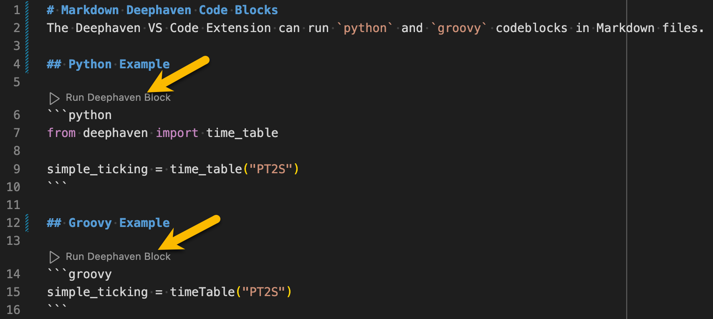
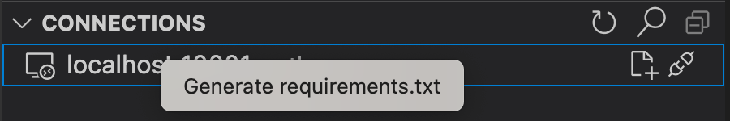

# Deephaven VS Code Extension

This is the official Deephaven extension for Visual Studio Code. Use it to run queries against running Deephaven servers from VS Code directly. The extension supports both Deephaven Community and Enterprise servers.

## About Deephaven

Deephaven is a high-performance time-series database, complemented by a full suite of API's and an intuitive user experience. Deephaven integrates with Java / Groovy, Python, R, C#, and C++ applications and libraries, as well as open-source data and ML technologies. It is a complete data system that empowers your team to build analyses, models, algos, reports, and dashboards very quickly. It excels at churning through massive real-time data sets, and performing analysis on historical or alternative data sets.

## Installation

Install the extension from one of two places:

- The [VS Code Marketplace](https://marketplace.visualstudio.com/items?itemName=deephaven.vscode-deephaven)
- VS Code's built-in extension browser

A search for `Deephaven` in either place will yield the Deephaven VS Code extension as the first result.


Once installed, the Deephaven icon will show up in the activity bar on the left side of VS Code:


By default, the extension is only configured to connect to a single Community server hosted at `http://localhost:10000`. See more about adding, removing, and updating servers in the [Configuration](#configuration) section below.

## Usage

You can run Deephaven code in two ways.

### Run code against a Deephaven server

You can execute files as queries against a running Deephaven server with this extension. To do so, your file needs to match the language of the server you are connecting to (Python or Groovy). Atop the file, click the `Run Deephaven File` action.


A new connection will appear in the [`CONNECTIONS` panel](#connections) on the left hand side of VS Code when you execute the code. Additionally, the [`PANELS` tree](#panels) below will show any variables exposed in the connection. To disconnect, hover over the connection item and click the trash icon.

### Markdown Code Blocks

The extension also supports running code blocks in markdown files. Like with [running entire files](#run-code-against-a-deephaven-server), the code block must match the language of the server you are connecting to. Atop the code block, click the `Run Deephaven Block` action.



## Configuration

By default, the extension is configured to connect to a single Community server hosted at `http://localhost:10000`.

To add more servers or change the configuration of the default server, head to VS Code settings. This opens a settings UI, where you can search for the extension with `@ext:deephaven.vscode-deephaven`. It shows two items you can configure:


> Note: There are some known VS Code bugs that can cause flakiness with the `run` button. VS Code v90 introduced an optional setting `workbench.editor.alwaysShowEditorActions`. Set this to `true` both improves the experience and prevents the run button from disappearing when running commands or selecting the dropdown. See [here](https://github.com/deephaven/vscode-deephaven/issues/1) for more details.

### Community Servers

Community servers can be configured via the `"deephaven.coreServers"` setting in `VS Code` user or workspace settings.


### Enterprise Servers

Enterprise servers can be configured via the `"deephaven.enterpriseServers"` setting in `VS Code` user or workspace settings.

```jsonc
"deephaven.enterpriseServers": [
  // Simplest config is to provide the server URL
  "https://my-server-a.acme.org:8123/",
  // Advanced config
  {
    "url": "https://my-server-b.acme.org:8123/",
    "label": "Server B",
    // Configure PQ workers created by the extension
    "experimentalWorkerConfig": {
      "heapSize": 0.5
    }
  }
]
```


For information on how to authenticate with enterprise servers, see [Enterprise Authentication](docs/enterprise-auth.md).

### SSL Certificates

Deephaven servers using self-signed certificates or internal CA's will require configuring VS Code to trust the signing certificate.

#### Option 1 - `NODE_EXTRA_CA_CERTS` Environment Variable

1. Save the signing certificate in PEM format somewhere on the machine running VS Code. Multiple certificates can be concatenated together in the same file if there are multiple certs that need to be configured.
1. Set the `NODE_EXTRA_CA_CERTS` environment variable to the path of the signing certificate.
   
   On Mac / Linux, you set the env variable or if you'd like for it to persist, you can export it from an appropriate config file for your shell.
   ```sh
   export NODE_EXTRA_CA_CERTS=/path/to/cert.pem
   ```

   On Windows, you can use `set` to set the variable in your current shell, or `setx` to persist it.

   ```sh
   setx NODE_EXTRA_CA_CERTS C:\Path\To\cert.pem
   ```
   > Note that paths in env variables should not be wrapped in quotes on Windows.
1. Start VS Code in a shell that has the `NODE_EXTRA_CA_CERTS` variable set.

> Note: VS Code runs in NodeJS which does not consult the trust store of the OS to determine trusted certificates. Instead, it comes pre-installed with a set of trusted root CA's. Any CA's that are not installed with NodeJS will need to be configured as described above. See [here](https://nodejs.org/docs/latest-v22.x/api/cli.html#node_extra_ca_certsfile) for more information on `NODE_EXTRA_CA_CERTS`.

### Option 2 - (Experimental) Using OS Trust Store

> Note: This option changes the underlying transport used by all installed VS Code extensions and is still in active development by the VS Code team. It is possible this may cause undesirable side effects with some extensions.

This step assumes your signing certificates are already configured as trusted by your particular OS's trust store. The process for doing this varies based on OS and is outside of the scope of this README.

Configure VS Code to use the OS trust store:

1. Click `f1` and type `> Preferences: Open Settings (UI)`
1. Search for the `Http: Electron Fetch` setting
   
1. Enable it
1. Restart VS Code

## Workspace setup

It is recommended to configure a [Python virtual environment](https://code.visualstudio.com/docs/python/python-tutorial#_create-a-virtual-environment) within your VS Code workspace. To get features like Intellisense for packages that are installed on the Deephaven server, you must to install the same packages in your local virtual environment.

A `requirements.txt` file can be generated containing all of the packages installed on the server by:

1. Connect to a Deephaven server
1. Right-click on the connection in the [`CONNECTIONS` panel](#connections) on the left side of VS Code
1. Click `Generate requirements.txt` action

   

> Note: Python code executed by the extension always runs on the server, while the local environment drives language features in `VS Code` such as Intellisense. For Community, it is possible for the server to share the same environment as `VS Code`. For Enterprise, they will always be separate.

### Managed pip Servers (Community only)

If you want to manage Deephaven servers from within the extension, include `deephaven-server` in the venv pip installation.

Once installed, clicking the `refresh` button in the [server tree panel](#servers) should reveal a `Managed` servers node.


Hovering over the `Managed` node shows a Play button that starts a server.


## Panels

There are three panels in the Deephaven extension. They appear on the left side of the VS Code window below the activity bar.

### Servers

The `Servers` panel shows the status of all configured servers.

If the `deephaven-server` pip package is available your local workspace, the panel will also show a "Managed" servers node (note that managed servers are Community servers that target the current `VS Code` workspace).


### Connections

The `CONNECTIONS` panel shows all active connections + editors currently associated with them. Hovering over nodes will show additional contextual action icons.


Editors can be dragged from 1 active connection to another.

### Panels

The `Panels` panel shows exported variables available on an active connection. Clicking a variable will open or refresh the respective output panel.


## Troubleshooting

VS Code extensions capture diagnostic and error details, storing them on the computer where VS Code is installed. You can save these logs as a .zip file to a destination of your choice by typing `> Deephaven: Download Logs` in the VS Code command palette.


Additionally, whenever an error occurs, you can access the logs directly by clicking the Download Logs button in the error notification pop-ups.

