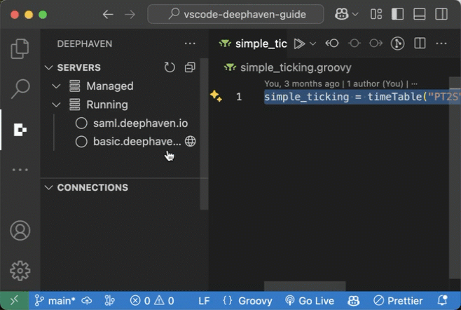

# Deephaven VS Code Extension

This is the official Deephaven extension for Visual Studio Code. Use it to run queries against running Deephaven servers from VS Code directly. The extension supports both Deephaven [Community](https://deephaven.io/core/docs/) and [Enterprise](https://deephaven.io/enterprise/docs/) servers.

## About Deephaven

[Deephaven](https://deephaven.io/) is a high-performance time-series database, complemented by a full suite of APIs and an intuitive user experience. Deephaven integrates with Java / Groovy, Python, R, C#, and C++ applications and libraries, as well as open-source data and ML technologies. It is a complete data system that empowers your team to build analyses, models, algos, reports, and dashboards very quickly. It excels at churning through massive real-time data sets, and performing analysis on historical or alternative data sets.

## Installation

Install the Deephaven VS Code extension from one of two places:

- The [VS Code Marketplace](https://marketplace.visualstudio.com/items?itemName=deephaven.vscode-deephaven)
- VS Code's built-in extension browser

A search for `Deephaven` in either place will yield the Deephaven VS Code extension as the first result.

Once installed, the Deephaven icon will show up in the activity bar on the left side of VS Code:

By default, the extension is only configured to connect to a single Community server hosted at `http://localhost:10000`. See more about adding, removing, and updating servers in the [Configuration](docs/configuration.md) docs.

## Features

### Run Deephaven Queries

Run Deephaven queries from local scripts against Deephaven Community and Enterprise servers. See the [Usage documentation](docs/usage.md) for details:

### Run Markdown Codeblocks

Run Deephaven code blocks from markdown files. See the [Usage documentation](docs/usage.md#markdown-code-blocks) for details:

### Manage Deephaven Servers

Manage pip installed Deephaven Community servers. See the [Managed pip Servers documentation](docs/workspace-setup.md#managed-pip-servers-community-only) for details:

### Manage Credentials

Manage private / public server keys. See the [Private / Public Key Pair Login documentation](docs/enterprise-auth.md#private--public-key-pair-login) for details:

### Model Context Protocol (MCP) Support

Enable AI assistants in VS Code and VS Code-based IDEs (like Windsurf) to interact with the Deephaven VS Code extension programmatically, and through it, with Deephaven servers. See the [MCP documentation](docs/mcp.md) for details.

## Documentation

- [Installation](docs/installation.md)
- [Usage](docs/usage.md)
- [Configuration](docs/configuration.md)
- [Workspace Setup](docs/workspace-setup.md)
- [Panels](docs/panels.md)
- [Model Context Protocol (MCP)](docs/mcp.md)
- [MCP Tool Guide](docs/mcp-tools.md)
- [Python Remote File Sourcing](docs/python-remote-file-sourcing.md)
- [Troubleshooting](docs/troubleshooting.md)
- [Data Storage](docs/data-storage.md)
- [Contributing](CONTRIBUTING.md)
