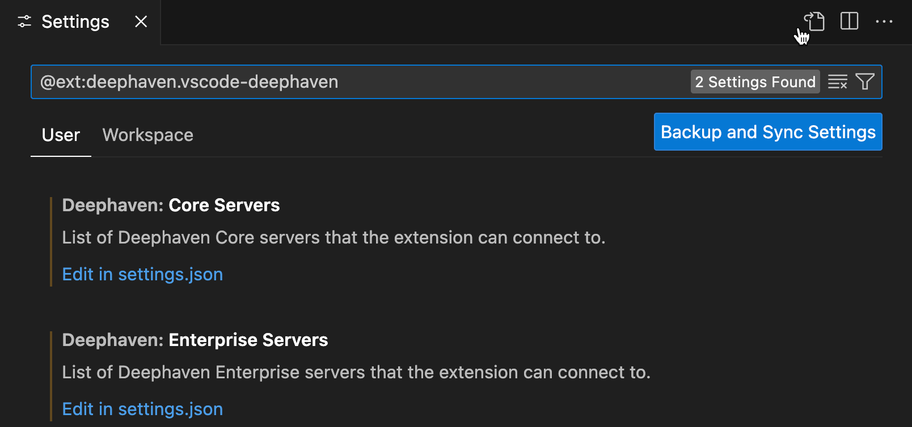
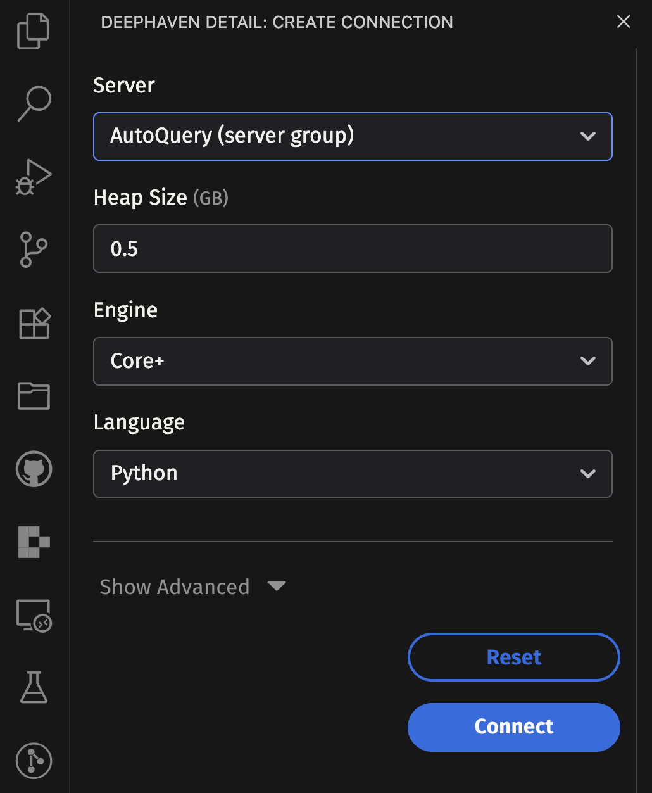
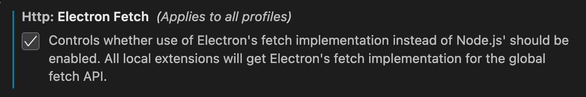

# Deephaven VS Code - Configuration

By default, the extension is configured to connect to a single Community server hosted at `http://localhost:10000`.

To add more servers or change the configuration of the default server, head to VS Code settings. This opens a settings UI, where you can search for the extension with `@ext:deephaven.vscode-deephaven`. It shows two items you can configure:



You can also set configuration parameters in workspaces by navigating to the `Workspace` tab in the settings UI.

> Note: There are some known VS Code bugs that can cause flakiness with the `run` button. VS Code v90 introduced an optional setting `workbench.editor.alwaysShowEditorActions`. Setting this to `true` both improves the experience and prevents the run button from disappearing when running commands or selecting the dropdown. See [here](https://github.com/deephaven/vscode-deephaven/issues/1) for more details.

## Community Servers

Community servers can be configured via the `"deephaven.coreServers"` setting in `VS Code` user or workspace settings.


## Enterprise Servers

Enterprise servers can be configured via the `"deephaven.enterpriseServers"` setting in `VS Code` user or workspace settings.

Basic example:

```jsonc
"deephaven.enterpriseServers": [
  "https://my-server-a.acme.org:8123/"
]
```

An optional label can be included:

```jsonc
"deephaven.enterpriseServers": [
  {
    "url": "https://my-server-b.acme.org:8123/",
    "label": "Server B"
  }
]
```

When connecting to an Enterprise server, you will be presented with a panel to configure your query using the standard query creation UI.



Grizzly servers do not support the query creation UI, but you can use the `experimentalWorkerConfig` property to specify query (worker) settings directly in your VS Code settings.

Example configuration:

```jsonc
"deephaven.enterpriseServers": [
  {
    "url": "https://my-grizzly-server.acme.org:8123/",
    "label": "Grizzly Server",
    // Legacy: Only needed for Grizzly servers since they don't support the query creation UI
    "experimentalWorkerConfig": {
      "additionalMemory": 1.0,
      "classPaths": "/path/to/Some.jar",
      "dbServerName": "MyServer",
      "engine": "Core+",
      "envVars": "SOME_ENV=SOME_VALUE",
      "heapSize": 0.5,
    }
  }
]
```


For information on how to authenticate with enterprise servers, see [Enterprise Authentication](enterprise-auth.md).

## SSL Certificates

Deephaven servers using self-signed certificates or internal CA's will require configuring VS Code to trust the signing certificate.

### Option 1 - `NODE_EXTRA_CA_CERTS` Environment Variable

1. Save the signing certificate in PEM format somewhere on the machine running VS Code. Multiple certificates can be concatenated together in the same file if there are multiple certs that need to be configured.
1. Set the `NODE_EXTRA_CA_CERTS` environment variable to the path of the signing certificate.

   On Mac / Linux, set the env variable, or if you'd like for it to persist, export it from an appropriate config file for your shell.
   ```sh
   export NODE_EXTRA_CA_CERTS=/path/to/cert.pem
   ```

   On Windows, you can use `set` to set the variable in your current shell, or `setx` to persist it.

   ```sh
   setx NODE_EXTRA_CA_CERTS C:\Path\To\cert.pem
   ```
   > Note that paths in env variables should not be wrapped in quotes on Windows.
1. Start VS Code in a shell that has the `NODE_EXTRA_CA_CERTS` variable set.

> Note: VS Code runs in NodeJS which does not consult the trust store of the OS to determine trusted certificates. Instead, it comes pre-installed with a set of trusted root CA's. Any CA's that are not installed with NodeJS will need to be configured as described above. See [here](https://nodejs.org/docs/latest-v22.x/api/cli.html#node_extra_ca_certsfile) for more information on `NODE_EXTRA_CA_CERTS`.

## Option 2 - (Experimental) Using OS Trust Store

> Note: This option changes the underlying transport used by all installed VS Code extensions and is still in active development by the VS Code team. It is possible this may cause undesirable side effects with some extensions.

This step assumes your signing certificates are already configured as trusted by your particular OS's trust store. The process for doing this varies based on OS and is outside of the scope of this README.

Configure VS Code to use the OS trust store:

1. Click `f1` and type `> Preferences: Open Settings (UI)`
1. Search for the `Http: Electron Fetch` setting
   
1. Enable it
1. Restart VS Code
