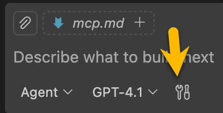
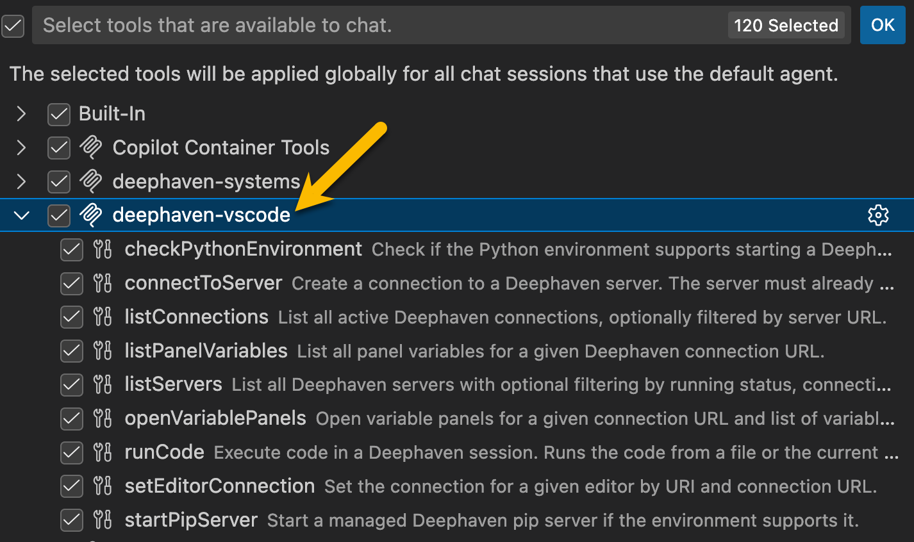

# Deephaven VS Code MCP Server (experimental)

## VS Code Installation
- Download and install [vscode-deephaven-1.1.6-mcp-dev.0.vsix](https://github.com/deephaven/vscode-deephaven/raw/refs/heads/mcp/releases/vscode-deephaven-1.1.6-mcp-dev.0.vsix)
- Restart VS Code
- Should see a popup in the bottom right that the MCP server has started, and a `.vscode/mcp.json` file should get created. e.g.:
   ```json
   {
    "servers": {
      "deephaven-vscode": {
        "type": "http",
        "url": "http://localhost:51520/mcp"
      }
    }
  }
  ```
- Copilot should now have access to the MCP server



## Windsurf
- Download and install [vscode-deephaven-1.1.6-mcp-dev.0.vsix](https://github.com/deephaven/vscode-deephaven/raw/refs/heads/mcp/releases/vscode-deephaven-1.1.6-mcp-dev.0.vsix)
- Restart Windsurf
- Should see a popup in the bottom right that the MCP server has started, and a `.vscode/mcp.json` file should get created.

> Note that Windsurf won't actually use the mcp.json file, so there's an extra step. Windsurf doesn't seem to have a workspace level mcp settings (although I may just be missing it). There is a user level mcp settings file at `~/.codeium/windsurf/mcp_config.json`. 

You can copy / modify your `.vscode/mcp.json` contents to the Windsurf user settings:

`.vscode/mcp.json`
```json
{
  "servers": {
    "deephaven-vscode": {
      "type": "http",
      "url": "http://localhost:51520/mcp"
    }
  }
}
```

becomes

`~/.codeium/windsurf/mcp_config.json`
```json
{
  "mcpServers": {
    "deephaven-vscode": {
      "serverUrl": "http://localhost:51520/mcp"
    }
  }
}
```