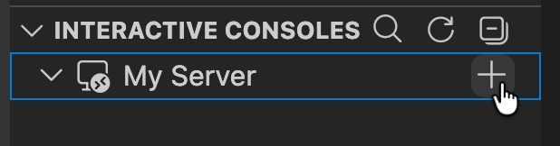
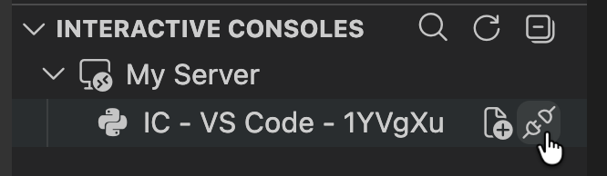
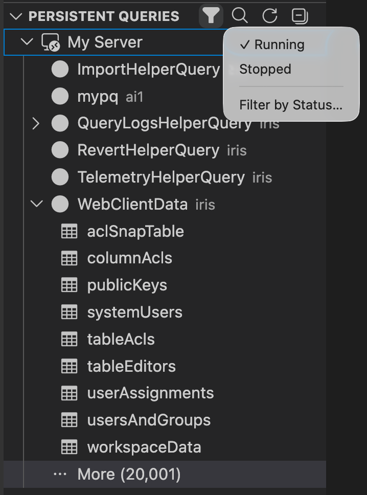

# Deephaven VS Code - Panels

There are three panels in the Deephaven extension. They appear on the left side of the VS Code window below the activity bar.

## Servers

The `SERVERS` panel shows the status of all configured servers.

If the `deephaven-server` pip package is available in your local workspace, the panel will also show a "Managed" servers node (note that managed servers are Community servers that target the current `VS Code` workspace).

## Interactive Consoles

The `INTERACTIVE CONSOLES` panel shows all active connections grouped under their server. Each worker node lists the editors currently associated with it, followed by associated files and the exported variables available on its session. Clicking a variable will open or refresh the respective output panel. Hovering over nodes will show additional contextual action icons.

Editors can be dragged from one active connection to another.

### Creating a Worker

To start a new interactive console worker on an enterprise server, hover the server node in this panel and click the `+` (`Create Worker`) action.

Servers that support the query creation UI will present it so you can configure the worker. [Grizzly servers](configuration.md#enterprise-servers) do not, and use the `experimentalWorkerConfig` setting instead.

### Disconnecting from a Worker

Hover a worker node and click the disconnect icon to disconnect from it. This action is only available on workers that were started from `VS Code`. Workers that were already running when you connected to the server are left running.

## Persistent Queries

The `PERSISTENT QUERIES` panel shows the persistent queries visible to you on each connected enterprise server, listed beneath the server that owns them. Servers older than Grizzly+ cannot provide this list and are omitted from the panel entirely. Expanding a running query lists the objects it exports; clicking one opens it in a panel.

The filter icon in the panel title chooses which statuses are listed:

- `Running` covers queries that are running or starting up; `Stopped` covers those that have finished or are shutting down, plus queries reporting no status at all. By default `Running` is checked and `Stopped` is not.
- An entry is checked only while every status in its group is listed. Clicking a checked entry hides the whole group; clicking an unchecked one lists all of it.
- `Filter by Status...` opens a per-status checkbox list, with the number of queries currently in each status, for finer control.
