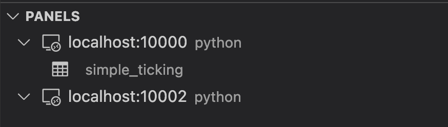

# Deephaven VS Code - Panels

There are four panels in the Deephaven extension. They appear on the left side of the VS Code window below the activity bar.

## Servers

The `SERVERS` panel shows the status of all configured servers.

If the `deephaven-server` pip package is available in your local workspace, the panel will also show a "Managed" servers node (note that managed servers are Community servers that target the current `VS Code` workspace).

## Interactive Consoles

The `INTERACTIVE CONSOLES` panel shows all active connections grouped under their server. Each worker node lists the editors currently associated with it, followed by the exported variables available on its session. Clicking a variable will open or refresh the respective output panel. Hovering over nodes will show additional contextual action icons.

Worker names end in a generated id, so nodes show a shortened form of the name — hover a worker node to see its full name.

Editors can be dragged from one active connection to another.

## Persistent Queries

The `PERSISTENT QUERIES` panel shows the persistent queries visible to you on each connected enterprise server, grouped into `Running` and `Stopped`. Queries that are starting up or otherwise in transition show a spinner and are listed under `Running`. Expanding a running query lists the objects it exports; clicking one opens it read-only in a panel.

## Panels

The `PANELS` panel shows exported variables available on an active connection. Clicking a variable will open or refresh the respective output panel.

> Note: this panel is superseded by the variables now listed under each worker in `INTERACTIVE CONSOLES` and will be removed.

