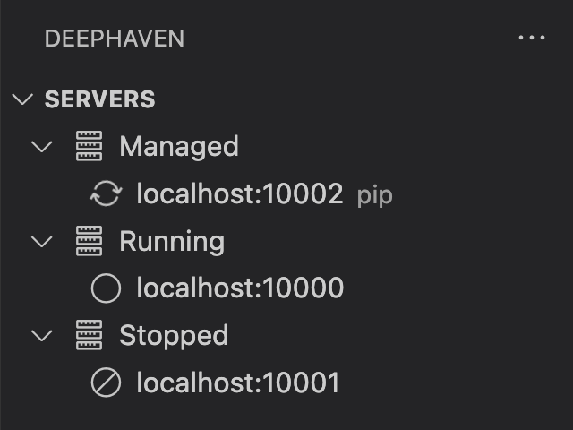
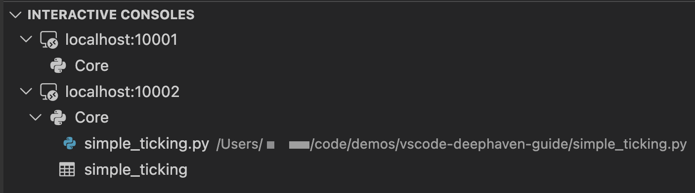

# Deephaven VS Code - Panels

There are three panels in the Deephaven extension. They appear on the left side of the VS Code window below the activity bar.

## Servers

The `SERVERS` panel shows the status of all configured servers.

If the `deephaven-server` pip package is available in your local workspace, the panel will also show a "Managed" servers node (note that managed servers are Community servers that target the current `VS Code` workspace).

## Interactive Consoles

The `INTERACTIVE CONSOLES` panel shows all active connections grouped under their server. Each worker node lists the editors currently associated with it, followed by the exported variables available on its session. Clicking a variable will open or refresh the respective output panel. Hovering over nodes will show additional contextual action icons.

Worker names end in a generated id, so nodes show a shortened form of the name — hover a worker node to see its full name.

Editors can be dragged from one active connection to another.

## Persistent Queries

The `PERSISTENT QUERIES` panel shows the persistent queries visible to you on each connected enterprise server, listed directly beneath the server that owns them. Each query's icon shows its status: a filled circle for a running query, a slashed circle for a stopped or failed one, a hollow circle when the server reports no status, and a spinner while it is still in motion — starting up, or stopping. Expanding a running query lists the objects it exports; clicking one opens it read-only in a panel.

The funnel in the panel title chooses which statuses are listed. It opens a menu with a `Running` and a `Stopped` entry: `Running` covers queries that are running or starting up, and `Stopped` covers those that have finished or are shutting down, plus queries reporting no status at all. An entry is checked only while every status in its group is listed — clicking a checked entry hides the whole group, and clicking an unchecked one (whether the group is partly or entirely hidden) lists all of it. By default `Running` is checked and `Stopped` is not. `Filter by Status...` in the same menu opens a per-status checkbox list, with the number of queries currently in each status, for finer control. The funnel is filled while a filter is hiding something, and each affected server node gets a trailing `More (N)` entry after its queries, where `N` is how many it is hiding; clicking that entry reopens the filter.
