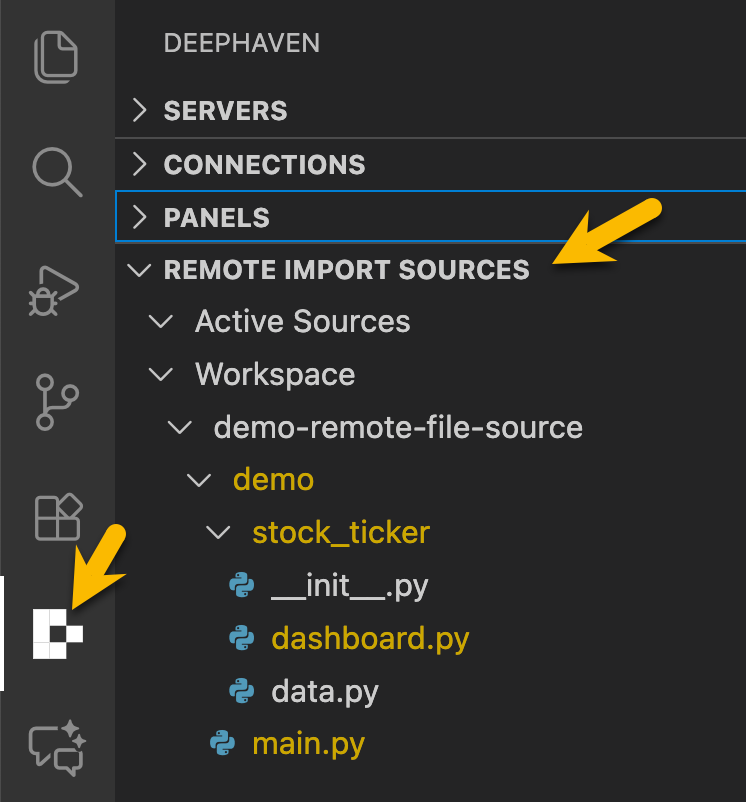
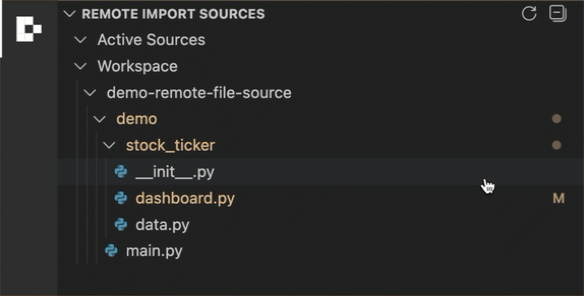
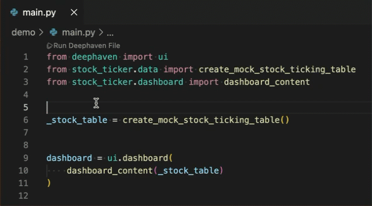

# Python Remote File Sourcing

The **Remote File Source** feature allows you to provide Python packages and modules from your local VS Code workspace to a running Deephaven server. This is especially useful for sharing custom Python code, utilities, or dependencies with your remote Deephaven environment, without needing to manually upload or install them on the server.

This capability is enabled by the `deephaven-plugin-python-remote-file-source` plugin, which must be installed on the Deephaven Community or Enterprise Core+ worker being used. The VS Code extension manages the connection and sharing process.

## How It Works

1. **Marking Folders as Remote File Sources**: In VS Code, you can mark one or more folders in your workspace to be exposed as remote file sources. These folders will be made available to the connected Deephaven worker as importable Python packages.

2. **Server-Side Plugin**: The Deephaven worker must have the `deephaven-plugin-python-remote-file-source` installed and enabled. This plugin allows the server to recognize and import Python modules provided by the VS Code extension.

3. **Importing in Deephaven**: Once a folder is marked and a connection is active, you can import your local Python modules in Deephaven scripts as if they were installed on the worker. For example:

```python
from my_local_package import my_module
```

## Installing the deephaven-plugin-python-remote-file-source Plugin

The `deephaven-plugin-python-remote-file-source` plugin can be installed as a `pip` package on a Deephaven Core or Core+ worker. If you are using the managed pip server within the VS Code extension, you can simply install in the `.venv` associated with your VS Code workspace by adding it to a `requirements.txt` file or by running `pip install deephaven-plugin-python-remote-file-source`.

See the [Install and use plugins](https://deephaven.io/core/docs/how-to-guides/install-use-plugins/) for additional options.

## Marking and Unmarking Folders

You can mark or unmark folders as remote file sources in one of two ways:

1. Using the "Remote Import Sources" Panel
1. Using the Explorer Context Menu

### Using the "Remote Import Sources" Panel

- Open the **Remote Import Sources** panel in the Deephaven sidebar view.

  

- Browse your workspace folder tree in the panel.
- Click the **+** button beside a folder to add it as a remote file source.

  

- Click the **–** button beside a marked folder to remove it from remote file sources.

### Using the Explorer Context Menu

- In the VS Code Explorer, right-click a folder containing Python files.
- Select **"Add to Deephaven remote file sources"** to mark it.
- To unmark, right-click a marked folder and select **"Remove from Deephaven remote file sources"**.

## Example: Using a Local Package as a Remote File Source

The following example demonstrates how to use a local Python package as a remote file source so that imports work seamlessly in your Deephaven session.

### Folder Structure

Create the following file / folder structure in a VS Code workspace.

```
main.py
stock_ticker/
	__init__.py
	data.py
	dashboard.py
```

#### File contents

**main.py**

```python
from deephaven import ui
from stock_ticker.data import create_mock_stock_ticking_table
from stock_ticker.dashboard import dashboard_content

_stock_table = create_mock_stock_ticking_table()

dashboard = ui.dashboard(dashboard_content(_stock_table))
```

**stock_ticker/**init**.py**

```python
# No content needed, just marking this as a package
```

**stock_ticker/data.py**

```python
from deephaven import time_table


def create_mock_stock_ticking_table(
    symbol="AAPL",
    base_price=150,
    price_range=5,
    base_volume=1000,
    volume_range=500,
    period="PT1s",
):
    return time_table(period).update(
        [
            # Pick a symbol randomly from the set
            "Symbol = (new String[] {`AAPL`, `GOOG`, `MSFT`, `AMZN`, `TSLA`})[(int)(random() * 5)]",
            # Set base price depending on symbol
            "BasePrice = Symbol == `AAPL` ? 150 : Symbol == `GOOG` ? 2800 : Symbol == `MSFT` ? 300 : Symbol == `AMZN` ? 3500 : 700",
            # Price and volume
            f"Price = BasePrice + (random() * {price_range * 2} - {price_range})",
            f"Volume = (int)({base_volume} + random() * {volume_range})",
        ]
    )
```

**stock_ticker/dashboard.py**

```python
import deephaven.plot.express as dx
from deephaven import ui


@ui.component
def dashboard_content(table):
    """
    Create a dashboard for the given Deephaven table, with row click filtering.
    """
    selected_symbol, set_selected_symbol = ui.use_state(None)

    def handle_row_click(row):
        set_selected_symbol(row["Symbol"])

    ui_table = ui.table(table, density="compact", on_row_press=handle_row_click)

    filtered = ui.use_memo(
        lambda: table.where([f"Symbol == `{selected_symbol['value']}`"])
        if selected_symbol
        else table,
        [table, selected_symbol],
    )

    line_chart = ui.use_memo(
        lambda: dx.line(
            filtered, x="Timestamp", y="Price", title="Stock Price Over Time"
        ),
        [filtered],
    )

    return ui.column(
        ui.panel(ui_table, title="Mock Stock Ticking Table"),
        ui.panel(line_chart, title="Stock Price Line Chart"),
    )
```

### Running the Example

1. Mark the `stock_ticker` folder as a remote file source using the panel or context menu as described in [Marking and Unmarking Folders](#marking-and-unmarking-folders).
2. In your VS Code workspace, use the Deephaven extension to run `main.py`. The imports will resolve because the `stock_ticker` folder is registered as a remote file source.


