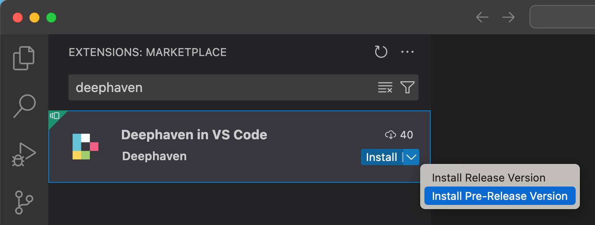
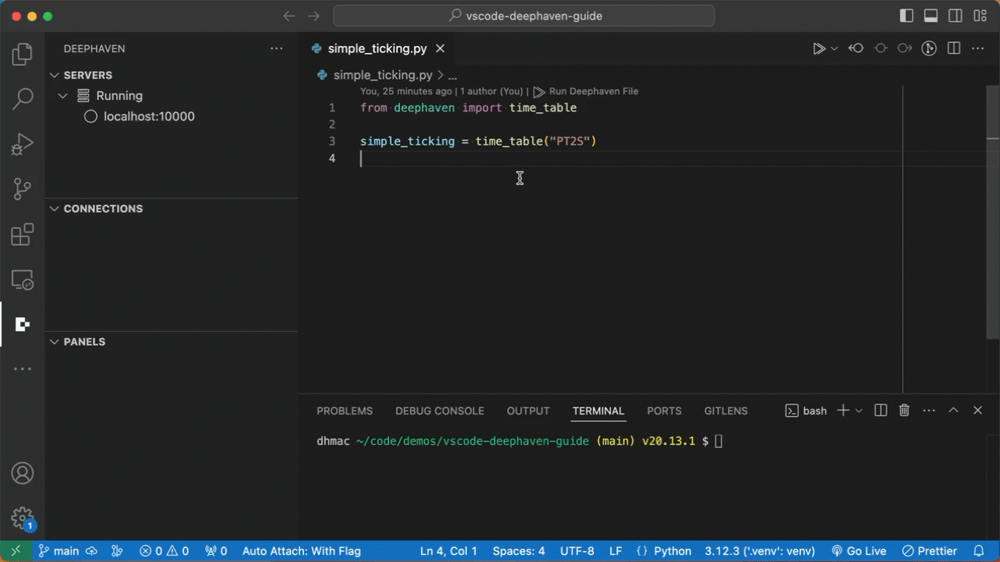
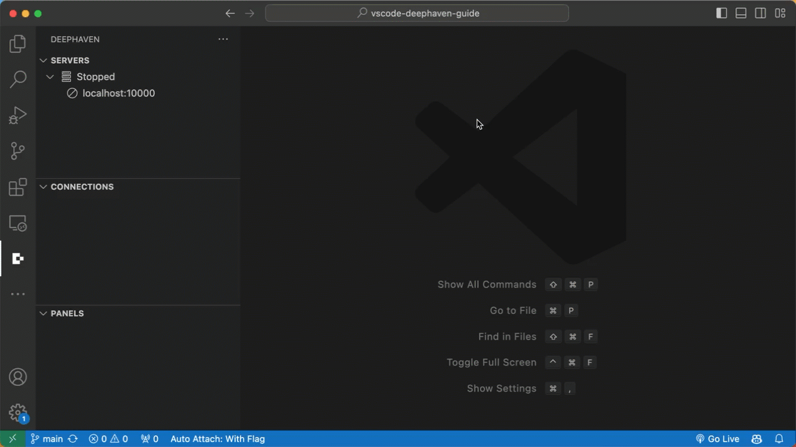
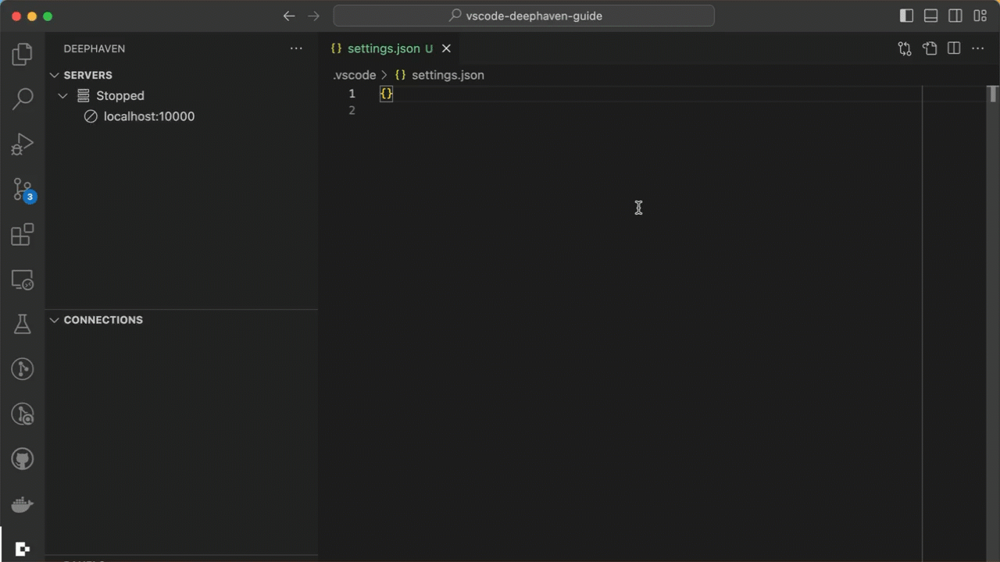
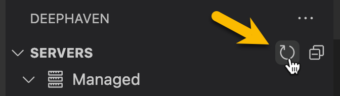
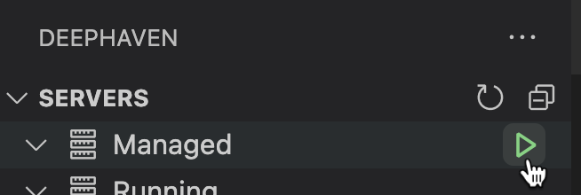
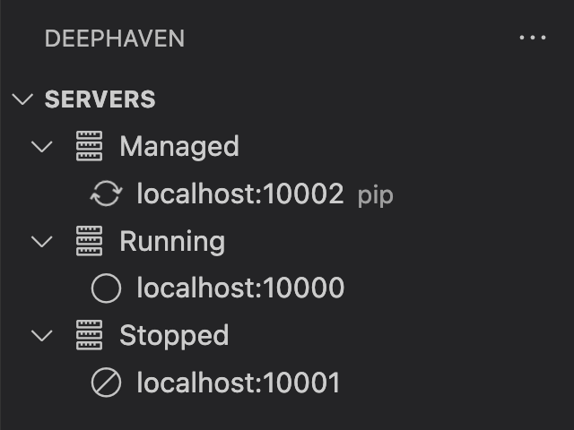
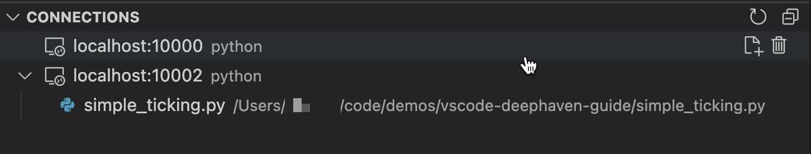
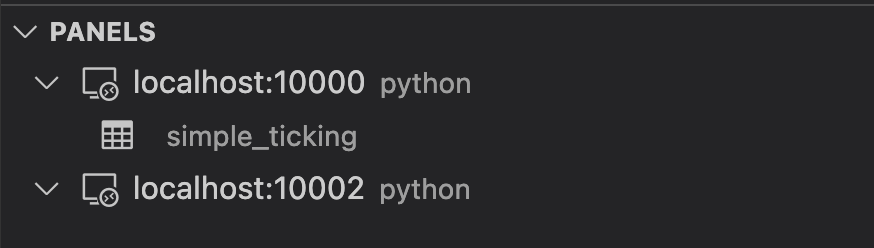

# Deephaven in Vscode - Quickstart

## Installation

The Deephaven in Vscode extension can be installed from the [Vscode Marketplace](https://marketplace.visualstudio.com/items?itemName=deephaven.vscode-deephaven) or from the extension browser inside of `vscode`. The extension is currently `pre-release`, so you'll need to install it as such.



Once installed, there will be a new icon in the `activity bar` (the sidebar containing navigation icons). Clicking the Deephaven icon will show a new panel containing details of configured Deephaven servers. By default, the extension is configured to connect to a single Community server hosted at `http:localhost:10000`.


The "SERVERS" tree will show the status of any configured servers. To run a script against a running server, simply click the `Run Deephaven File` action at the top of a file supported by the server (`python` or `groovy`).



A new connection will show up in the "CONNECTIONS" tree, and the "PANELS" should show any variables exposed on the connection. To disconnect, hover over the connection item and click the trash icon.

## Configuration

A single Community server `http://localhost:10000/` is configured by default and doesn't require any additional config. Additional connections can be configured in `vscode` settings.

> Note: There are some `vscode` bugs that cause some flakiness with the `run` button. vscode `v90` introduced an optional `workbench.editor.alwaysShowEditorActions` setting. Setting this to `true` improves the experience here. Namely the run button will not disappear when running commands or selecting its dropdown. See https://github.com/deephaven/vscode-deephaven/issues/1 for more details.

### Community Servers

Community servers can be configured via the `"deephaven.coreServers"` setting in vscode user or workspace settings.




### Enterprise Servers
Enterprise servers can be configured via the `"deephaven.enterpriseServers"` setting in vscode user or workspace settings.

```jsonc
"deephaven.enterpriseServers": [
  // Simplest config is to provide the server URL
  "https://my-server-a.acme.org:8123/",
  // Advanced config
  {
    "url": "https://my-server-b.acme.org:8123/",
    "label": "Server B",
    // Configure PQ workers created by the extension
    "experimentalWorkerConfig": {
      "heapSize": 0.5
    }
  }
]
```



## Workspace Setup
It is recommended to configure a virtual python environment within your `vscode` workspace. See https://code.visualstudio.com/docs/python/python-tutorial#_create-a-virtual-environment for a general overview. To get features like intellisense, you can install `deephaven` pip packages in the `venv`.

> Note: For Community, the server can share the same workspace location as vscode. For Enterprise, they will always be separate. For now, installing pip packages locally won't guarantee the same configuration that is running on the server, but it can still be helpful for many use cases. We will be implementing better support for this in the near future.

For example here's a minimal `requirements.text` file that will enable intellisense for common DH packages:
```text
deephaven-core
deephaven-plugin-plotly-express
deephaven-plugin-ui
```

### Managed Pip Servers (Community only)
If you want to manage DH servers from within the extension, you can include `deephaven-server` in the venv pip installation.

Once installed, clicking the "refresh" button in the server tree panel should reveal a "Managed" servers node.



Hovering over the "Managed" node should show a play button. Clicking it will start a server.



## Panels
### Servers Panel
The `servers` panel shows the status of all configured servers.

If the `deephaven-server` pip package is available your local workspace, the panel will also show a "Managed" servers node (note that managed servers are Community servers that target the current vscode workspace).



### Connections Panel
The `connections` panel shows all active connections + editors currently associated with them. Hovering over nodes will show additional contextual action icons.



Editors can be dragged from 1 active connection to another.

### Panels Panel
The `panels` panel shows exported variables available on an active connection. Clicking a variable will open or refresh the respective output panel.

