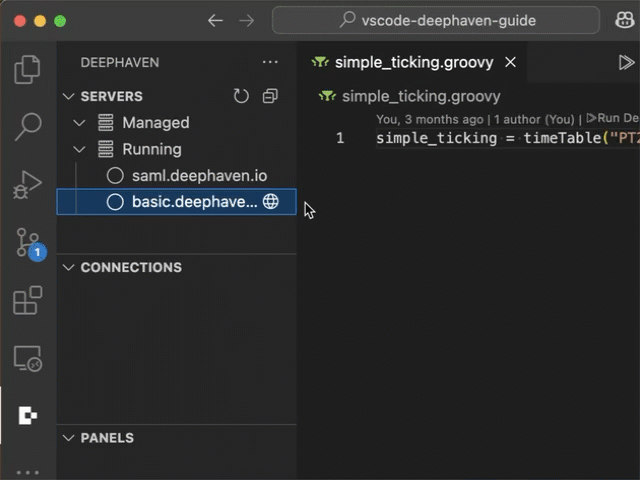
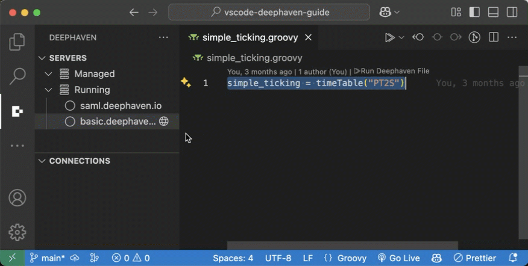
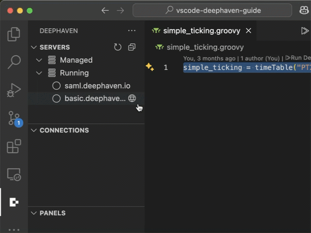

# Deephaven VS Code - Enterprise Authentication

The Deephaven VS Code extension supports multiple authentication methods for Enterprise servers.

- Basic Login
- Private / public key pair
- SAML based single sign-on

## Basic Login

By default, the extension will accept a basic username / password login to authenticate with a Deephaven Enterprise server. To initiate a login, click on a running server node in the servers list or run a script to initiate a connection.

## Private / Public Key Pair Login

The Deephaven VS Code extension supports generating a private / public key pair that can be used to authenticate with a Deephaven Enterprise server. A generated private key will be stored locally by the extension, and the corresponding public key will be stored on the Deephaven server associated with a username.

### Generating Key Pair

To generate a key pair:

- Right click on a running server node in the server list and click "Generate DHE Key Pair".
- You will be prompted to login with the username / password you would like to associate the key pair with.
- On successful login, the generated public key will be uploaded to the server and associated with the username.

After creating the key pair, clicking on the server node should prompt for a username. If you enter a username associated with a stored key pair, you will be able to login without a password.

### Deleting a Key Pair

To delete all Deephaven private keys managed by the extension from your local machine, you can type "Deephaven: Clear Secrets" in the VS Code command palette. Note that this action is irreversible, but it is easy to regenerate a key pair for any server you still want to keep access to.

### Single Sign-On

Deephaven Enterprise servers can be configured for single sign-on (SSO) using a Security Assertion Markup Language (SAML) identity provider. In order to support the necessary login redirects, the `authentication.samlauth.jetty.redirect.list` server prop will need to include `vscode://deephaven.vscode-deephaven/*`. The VS Code extension will automatically detect what kind of authentication is supported by a Deephaven server. If multiple options are available, the extension will prompt you to chose which one to use.

If a SAML login flow is initiated, you will be prompted a few times to step through the auth flow and to login to the configured identity provider in the browser. Once complete, the browser should redirect to VS Code with an active connection to the server.
