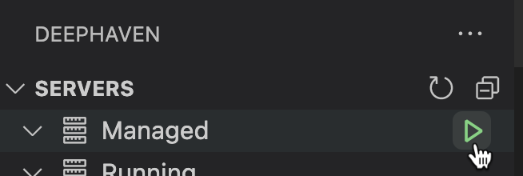

# Deephaven VS Code Extension

This is the official Deephaven extension for Visual Studio Code. Use it to run queries against running Deephaven servers from VS Code directly. The extension supports both Deephaven [Community](https://deephaven.io/core/docs/) and [Enterprise](https://deephaven.io/enterprise/docs/) servers.

## Features

### Run Deephaven Queries

Run Deephaven queries from local scripts against Deephaven Community and Enterprise servers. See the [Usage documentation](usage.md) for details:

### Run Markdown Codeblocks

Run Deephaven code blocks from markdown files. See the [Usage documentation](usage.md#markdown-code-blocks) for details:

### Manage Deephaven Servers

Manage pip installed Deephaven Community servers. See the [Managed pip Servers documentation](workspace-setup.md#managed-pip-servers-community-only) for details:

### Manage Credentials

Manage private / public server keys. See the [Private / Public Key Pair Login documentation](enterprise-auth.md#private--public-key-pair-login) for details:

Please see the following how-to guides for detailed documentation:

- [Installation](installation.md)
- [Usage](usage.md)
- [Configuration](configuration.md)
- [Workspace Setup](workspace-setup.md)
- [Panels](panels.md)
- [Troubleshooting](troubleshooting.md)
- [Enterprise Authentication](enterprise-auth.md)
- [Data Storage](data-storage.md)
