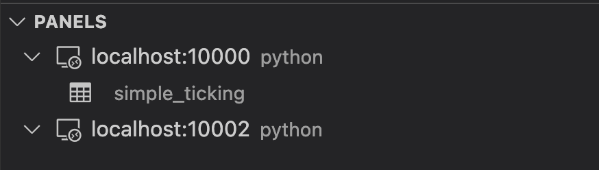

# Deephaven VS Code - Panels

There are three panels in the Deephaven extension. They appear on the left side of the VS Code window below the activity bar.

## Servers

The `SERVERS` panel shows the status of all configured servers.

If the `deephaven-server` pip package is available in your local workspace, the panel will also show a "Managed" servers node (note that managed servers are Community servers that target the current `VS Code` workspace).

## Connections

The `CONNECTIONS` panel shows all active connections + editors currently associated with them. Hovering over nodes will show additional contextual action icons.

Editors can be dragged from one active connection to another.

## Panels

The `PANELS` panel shows exported variables available on an active connection. Clicking a variable will open or refresh the respective output panel.

