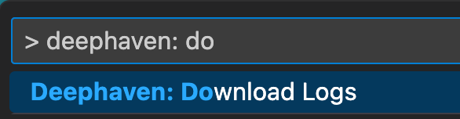
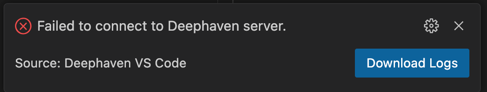

# Deephaven VS Code - Troubleshooting

VS Code extensions capture diagnostic and error details, storing them on the computer where VS Code is installed. You can save these logs as a .zip file to a destination of your choice by typing `> Deephaven: Download Logs` in the VS Code command palette.

Additionally, whenever an error occurs, you can access the logs directly by clicking the Download Logs button in the error notification pop-ups.

