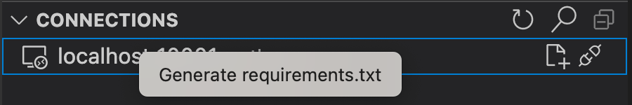
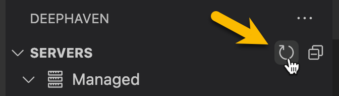

# Deephaven VS Code - Workspace Setup

It is recommended to configure a [Python virtual environment](https://code.visualstudio.com/docs/python/python-tutorial#_create-a-virtual-environment) within your VS Code workspace. To get features like Intellisense for packages that are installed on the Deephaven server, you must install the same packages in your local virtual environment.

A `requirements.txt` file can be generated containing all of the packages installed on the server by:

1. Connect to a Deephaven server
1. Right-click on the connection in the [`CONNECTIONS` panel](./panels.md#connections) on the left side of VS Code
1. Click `Generate requirements.txt` action

   

> Note: Python code executed by the extension always runs on the server, while the local environment drives language features in `VS Code` such as Intellisense. For Community, it is possible for the server to share the same environment as `VS Code`. For Enterprise, they will always be separate.

## Managed pip Servers (Community only)

If you want to manage Deephaven servers from within the extension, include `deephaven-server` in the venv pip installation.

Once installed, clicking the `refresh` button in the server tree panel should reveal a `Managed` servers node.

Hovering over the `Managed` node shows a Play button that starts a server.

