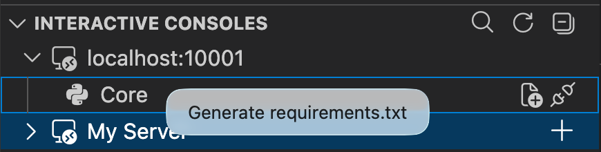
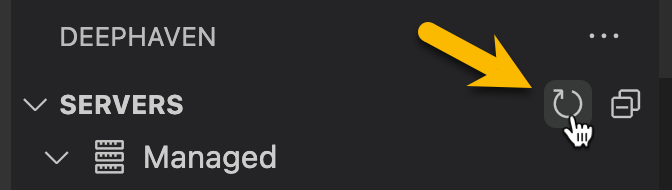
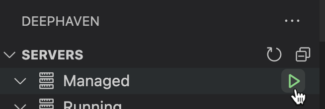

# Deephaven VS Code - Workspace Setup

It is recommended to configure a [Python virtual environment](https://code.visualstudio.com/docs/python/python-tutorial#_create-a-virtual-environment) within your VS Code workspace. To get features like Intellisense for packages that are installed on the Deephaven server, you must install the same packages in your local virtual environment.

A `requirements.txt` file can be generated containing all of the packages installed on the server by:

1. Connect to a Deephaven server
1. Right-click on the worker node in the [`INTERACTIVE CONSOLES` panel](./panels.md#interactive-consoles) on the left side of VS Code
1. Click `Generate requirements.txt` action

   

> Note: Python code executed by the extension always runs on the server, while the local environment drives language features in `VS Code` such as Intellisense. For Community, it is possible for the server to share the same environment as `VS Code`. For Enterprise, they will always be separate.

## Managed pip Servers (Community only)

Managed pip servers are driven by the [Python Environments](https://marketplace.visualstudio.com/items?itemName=ms-python.vscode-python-envs) extension (`ms-python.vscode-python-envs`), which VS Code installs automatically alongside this extension. The Deephaven server is started in whichever environment that extension has selected, so any environment manager it supports works — `venv`, `uv`, `conda`, and others. If the extension is disabled, the `Managed` servers node is hidden and the rest of the extension continues to work.

If you want to manage Deephaven servers from within the extension, install `deephaven-server` into the selected environment.

> [!NOTE]
> The server is started with the environment's `bin` directory prepended to `PATH` rather than through a full shell activation. For conda environments, this means `activate.d` scripts are not run, so variables they set (e.g. `JAVA_HOME` from conda's `openjdk` package) are not available. Make sure a compatible Java is available outside of the conda environment.

Once installed, the `Managed` servers node appears in the server tree panel. The extension watches for `deephaven-server` being installed or removed and for the selected environment changing, so the node normally updates on its own. If the node seems out of date, click the `refresh` button to force a re-check.

Hovering over the `Managed` node shows a Play button that starts a server.

